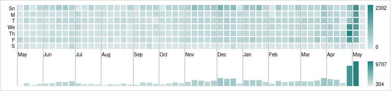
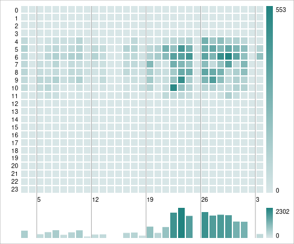

# Activity heatmap

A(nother) [d3.js](https://d3js.org/) heatmap representing time series data. Inspired by Github's contribution chart

Inspired by the excellent [DKirwan's Calendar Heatmap](https://github.com/DKirwan/calendar-heatmap).

Reworked for [d3.js](https://d3js.org/) v5 + ES6 class style.

## Screenshot

Yearly profile.



Monthly profile.



## Features & specs

* Heatmap
* Histogram
* Labels and scales
* Free time granularity
* Clean coding... (well tell me)
* Easy to tweak with options and profiles
* Fully localizable (uses only `moment.format()`)
  

## Dependencies

* [d3.js](https://d3js.org/) v5
* [moment.js](http://momentjs.com/)

## Usage

1. Add `d3.js` and `moment.js`

2. Include `activity-heatmap.js`
`<script src="path/to/activity-heatmap.js"></script>`

3. Add style stuff for tooltips

```CSS
.heatmap-tooltip {
  position: absolute;
  z-index: 9999;
  padding: 5px 9px;
  color: #bbbbbb;
  font-size: 12px;
  background: rgba(0, 0, 0, 0.85);
  border-radius: 3px;
  text-align: center;
}
```

4. Add some container
`<div id="my-heatmap"></div>`

5. Create the heatmap with some data

```js
  d3.json("url/to/my-data.json").then(function(data) {
    // do your AJAX stuff hear
    data.forEach(function(d) {
      // final data items should have at least a JS Date date...
      d.date = new Date(d.timestamp);
      // ...and a Number value.
      d.value = +d.value;
    });

    const map = new ActivityHeatmap(data, '#my-heatmap', 'yearly');
    map.render();
  });
```

## Options

The second arg can be an extensive options object.

The third arg is a profile hint that will tweak options. So you can override options after instantiation.

```js
const options = {
  selector: '#my-heatmap'
};
const map = new ActivityHeatmap(data, options, 'yearly');
map.options.period.from = new Date('2020-01-01');
```

Final computations will be done at render time.

Here is some common options:

```js
const options = {
  debug: false,
  selector: "#monthly",
  legend: true,
  histogram: true,
  frame: true,
  colors: {
    separator: "#AAAAAA",
    frame: "#AAAAAA",
    scale: ["#D8E6E7", "#218380"]
  }
};
```


## Example

Open `examples/ex1.html`.

NB: if you open `ex1.html` as local file, you may need to bypass `CORS` (With FF: `about:config` > `privacy.file_unique_origin` => **false**).
